## Concurrency

* Concurrency is about multiple things happening at `same time` in random order
* Go provides a `built-in support for concurrency`.

###### Why we need to think about concurrency ?

* To make use of underlying resources (cpu, memory,...) effectively and
* In order to run faster, application needs to be `divded into multiple independent units` and run them in parallel.

* Let's say we do have multi-core processor and our program is executing sequentially i.e. it's using only one core and remaining core's are in idle state.

* To make use of remaining cores, we need to write our program in concurrent way i.e. our program should utilize all the cores.

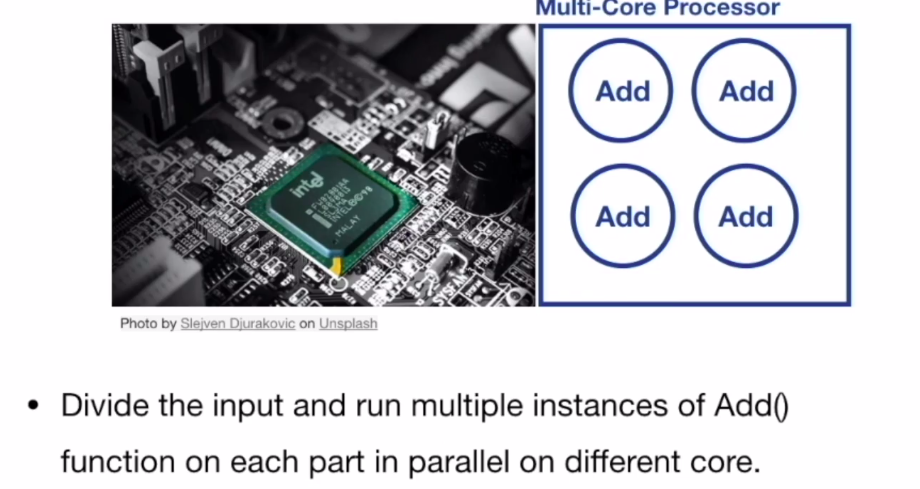

##### Concurrency

* Concurrency is a composition of `independent execution computations`, which may or may not run in parallel.

* Let's say we do have mutliple processes and a single core processor. in this case the single core will allocate time slices to each processe and allow them to execute based on the timestamp.so here handling multiple things at the same time

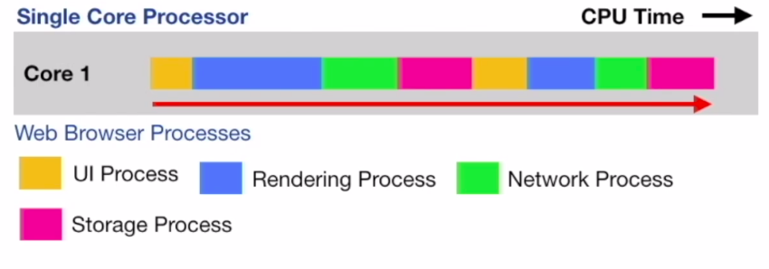

##### Parallelism
* Parallelism is an ability to `execute multiple computations simultaneously`.

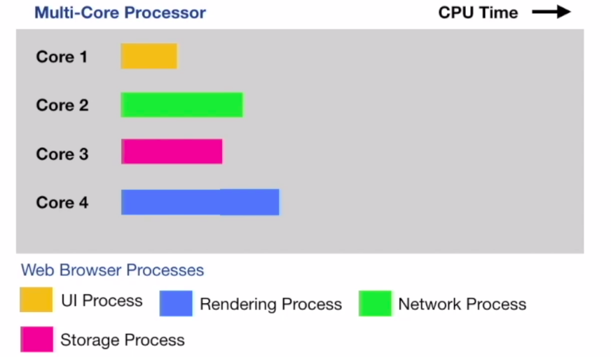

#### Note: Concurrency enables parallelism

##### Why there was a need to build concurrency primitives in Go ?

* The job of `operation system` is to give fair chance for all processes access to CPU, memory and other resources.
* An instance of a running program is called a `process`
* `process` provides enviroment for program to execute.

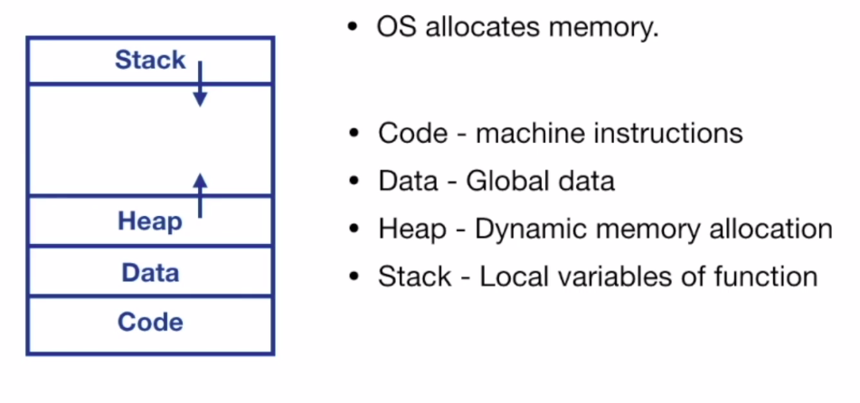

##### Threads

* Threads are `smallest unit of execution` that CPU accepts
* `process has atleast one thread - main thread`
* Process can have multiple threads and these share same address space
* Every thread has it's own stack, registers and PC

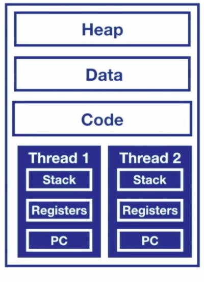

* Threads run independent of each other.
* `OS Scheduler makes scheduling decisions at thread level, not process level`
* Threads can run concurrently or in parallel.

###### Thread state

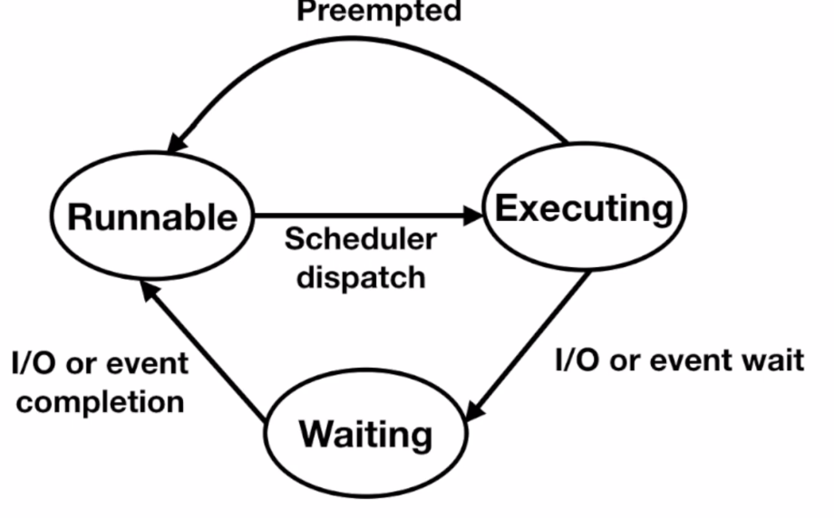

##### Can we divide our application into processes and threads and achieve concurrency?

###### Context switches are expensive

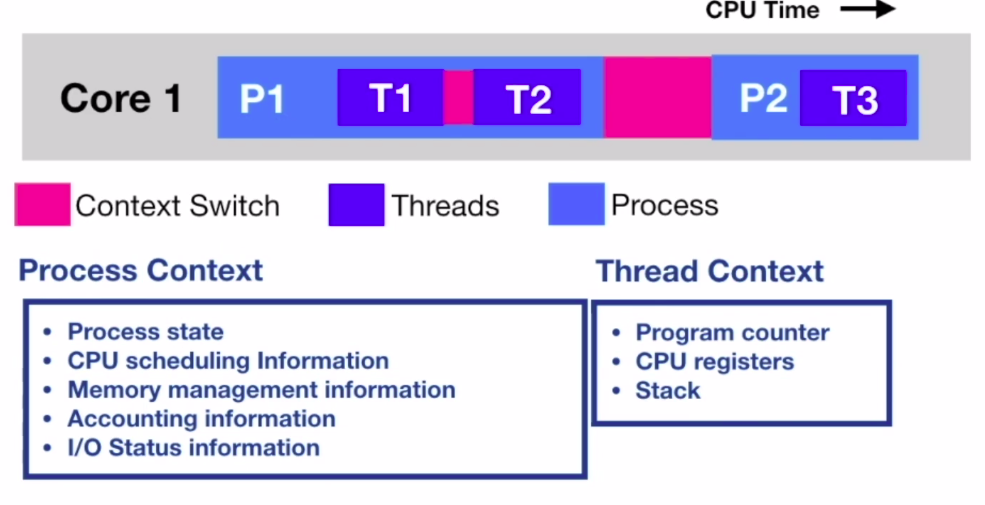

###### C10k Problem
* Scheduler allocates a process a time slice for execution on CPU core
* This CPU time slice is divided equally among threads

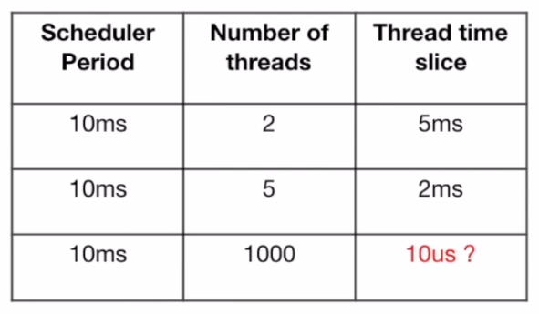

* If minimum time slice for thread is 2ms

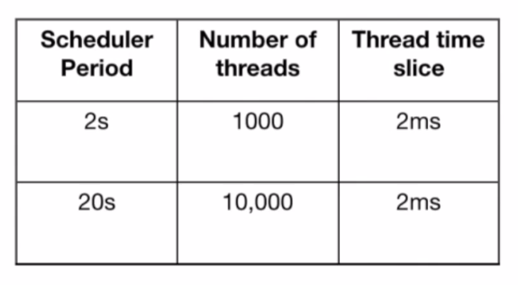

* Threads are allocated `fixed stach size` (on my machine it is `8MB`)

* Look for `stack size`

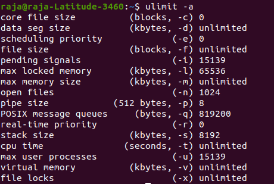

* So the limitations of thread are
    1. Fixed stack size
    2. C10K problem, as we scale up number of threads, scheduler cycle increases and application can become less responsive.

##### Why Concurrency is hard ?

* `Threads communicate between each other by sharing memory.`
* Sharing of memory between threads creates lot of complexity.
* Concurrent access to shared memory by two or more threads can lead to `Data Race` and outcome can be `Un-deterministic`

###### Concurrent Access and Atomicity

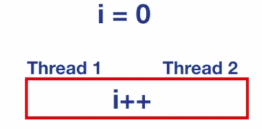

* Increment operation is not atomic. It involves,
    1. Retrieve the value of i
    2. Increment the value of i
    3. Store the value of i

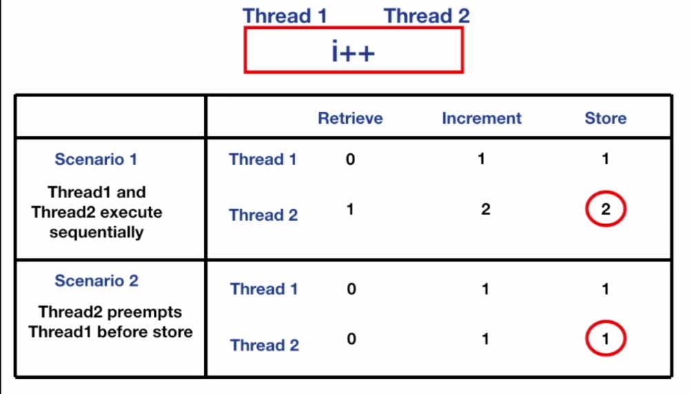

* On Concurrent access to memory leads to un-deterministic outcome.

###### Memory access synchronization
* We need to guard the access to shared memory so that a thread gets exclusive access at a time.

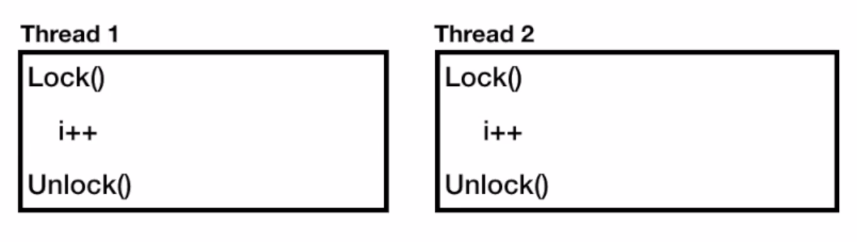

* It's a developer's convention to `lock()` and `unlock()`
* If Developers don't follow this convention, we have no guarantee of exclusive access!.

* Locking `reduces parallelism`. Locks force to execute sequentially.
* Inappropriate use of locks can lead to `Deadlocks`

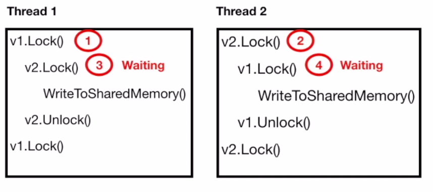