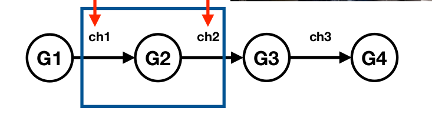

## Concurrency Patterns

### Pipelines
* Pipelines are used to process Streams or Batches of data.
* Pipelines enables us to make an efficient use of I/O and multiple CPU cores.
* Pipeline is a series of stages, connected by channels.
* Each stage is represented by a goroutine.



* Stage- take's data in, perform an operation on it, and send the data out.

##### Stages
* Seperate the concerts of each stage
* process individual stage concurrently
* A stage could consume and return the same type

    ```go
        func stage(in <-chan int) <- chan int{}
    ```
* Enables composability of pipeline
    ```go
        stage_3(stage_2(stage_1(data)))
    ```

### Fan-OUT * Fan-IN


* Can we break computationally intensive stage into multiple goroutines and run them in parallel to speed it up ? `Yes, We can`


###### Fan-OUT

* Multiple goroutines are started to read data from the single channel
* Distribute work amongst a group of workers goroutines to parallelize the CPU usage and the I/O usage.
* Helps computational intensive stage to run faster.

###### Fan-IN
* Process of combining multiple results into one channel
* We create Merge goroutines, to read data from multiple input channels and send the data to a single output channel.

### Pattern's in our Pipelines
* Upstream stages close their outbound channels when all the send operations are done.

    ```go
        func generator(nums ...int) <-chan int {
        out := make(chan int)

        go func() {
            defer close(out) // CLOSING UPSTREAM  OUTBOUND CHANNEL AFTER SENDING ALL ELEMENTS

            for _, num := range nums {
                log.Printf("[Generator-goroutine] Publishing %d on channel\n", num)
                out <- num
            }
        }()

        return out
    }
    ```

* Downstream stages keep receiving values from inbound channel until the channel is closed.

    ```go
        func square(in <-chan int) <-chan int {
            out := make(chan int)

            go func() {
                defer close(out)

                for num := range in { // KEEP LISTENING INBOUND CHANNEL TILL IT GET'S CLOSED
                    log.Printf("[Square] Squaring %d, and pushing on to channel\n", num)
                    out <- num * num
                }
            }()

            return out
        }
    ```

* All goroutines exit once all values have been successfully sent downstream

    ```go
        func merge(chans ...<-chan int) <-chan int {
            out := make(chan int)

            var wg sync.WaitGroup
            wg.Add(len(chans))

            merger := func(ch <-chan int) {
                defer wg.Done()

                for ele := range ch {
                    log.Printf("[m-goroutine] Merging number : %d \n", ele)
                    out <- ele
                }
            }

            go func() {
                for _, c := range chans {
                    go merger(c)
                }
            }()

            // ALL GO-ROUTINES EXIT ONCE ALL VALUES HAVE BEEN SUCCESSFULLY SENT
            go func() {
                wg.Wait()
                defer close(out)
            }()

            return out
        }
    ```

    ```go
        func main() {
            numbers := []int{1, 2, 3, 4, 5, 6, 7, 8}

            genC := generate(numbers...)

            square1C := square(1, genC)
            square2C := square(2, genC)

            mergeC := merge(square1C, square2C)

            // FINNALY ONCE THE MERGER CHANNEL CLOSED, MAIN ROUTINE ALSO EXITS
            for out := range mergeC { 
                log.Printf("[m-goroutine] Printing Response : %d\n", out)
            }
        }
    ```

### Real Pipelines
* Real pipelines - Receiver Stages may only need a subset of values to make progress
* A stage can exit early because an inbound value represents an error in an earlier stage
* Receiver should not have to waait for the remaining values to arrive
* we want earlier stages to stop producing values that later stages don't need.


    ```go
        func main() {
            numbers := []int{1, 2, 3, 4, 5, 6, 7, 8}

            genC := generate(numbers...)

            square1C := square(1, genC)
            square2C := square(2, genC)

            mergeC := merge(square1C, square2C)

            log.Printf("Got Message from Merge Channel : %d\n", mergeC)
        }
    ```
* main goroutine just receives one value
* Abandones the inbound channel from merge
* merge goroutines will be blocked on channel send operation
* square and generator goroutines will also be blocked on send
* This leads to `GOROUTINE LEAK`

* How can we signal to goroutine to abandon what they are doing and terminate ?

#### Cancellation of goroutines
* Pass a `read-only done` channel to goroutine
* Close the channel, to send broadcast siganl to all goroutines
* On receiving the signal on done channel, Goroutines needs to abandon their work and terminate
* We use `select` to make send/receive operation on channel pre-emptible

    ```go
        select{
        case out <- n :
        case <-done:
            return
        }
    ```

### Guidelines for Pipeline Construction
* stages close their outbound channels when all the send operations are done
* stages keep receiving values from inbound channels until those channels are closed or the senders are unblocked
* pipelines unblock senders by explicitly signalling senders when the receiver may abandon the channel

### Properties of pipeline stage


* Channels are used to receive and emit values
* `G1` generate batch of data into channel `ch1`
* A stage consumes and returns the same type
* Each stage takes
  * Common done channel
  * input channel
  * returns output channel