# Context Package

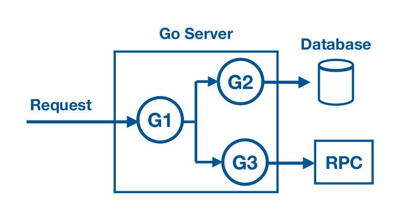

* How can we propagate ?
  * request-scoped data
  * cancellation signal

### Answer is `Context Package`
* Context Package serves two primary purpose
  - Provides API's for `cancelling branches of call-graph`
  - Provides a `data-bag for transporting request-scoped data through call-graph`

    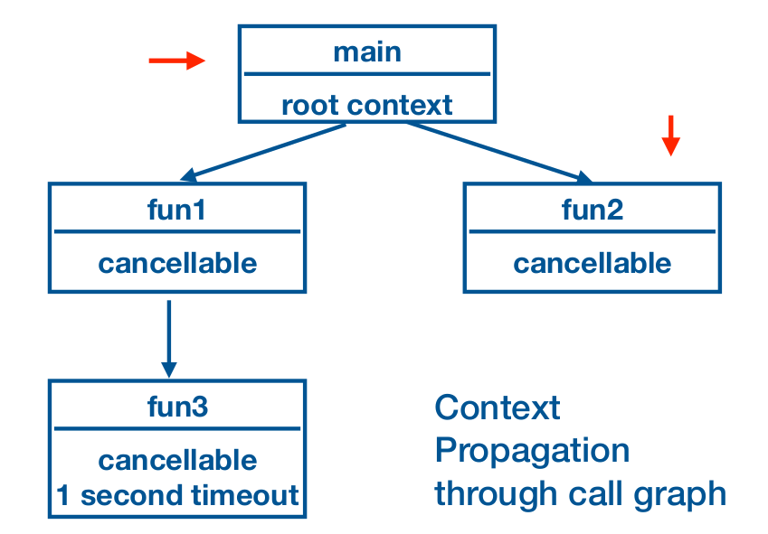

    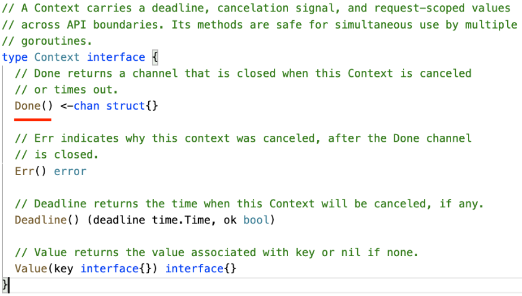

* A Context is safe for simultaneous use by multiple goroutines
* Single context can be passed to any number of goroutines.
* Cancelling the context, signals all the goroutines to abandon their work and terminate

##### Context Package Functions
* Context package provides functions to create new context
  * context.Background()
  * context.TODO()

###### Background()

    ```go
        ctx := context.Background()
    ```
  * Background returns a empty context
  * Root of any context tree
  * It is never canceled, has no value and has no deadline
  * Typically used by main function
  * Acts as a top level context for incoming request

###### TODO()

    ```go
        ctx := context.TODO()
    ```
  * TODO() returns an empty context
  * TODO's intended purpose is to serve as a placeholder

#### Context Package for cancellation
* Context is immutable
* Context package provides function to add new behaviour
* To add cancellation behaviour we have function's like,
    * context.WithCancel()
    * context.WithTimeout()
    * context.WithDeadline()
* The derived context is passed to child goroutines to facilitate their cancellation.

##### context.WithCancel(parentContext)

    ```go
        ctx, cancel := context.WithCancel(context.Background())
        defer cancel()
    ```
  * `WithCancel` returns a copy of parent with a new Done channel.
  * `cancel()` can be used to close context's done channel.
  * Closing the done channel indicates to an operation to abandon it's work and return
  * `Cancelling the context releases the resources` associated with it.

##### WithCancel()
* `cancel()` does not wait for the work to stop
* cancel() may be called by multiple goroutines simultaneously
* After the first call, subsequent calls to a cancel() do nothing

    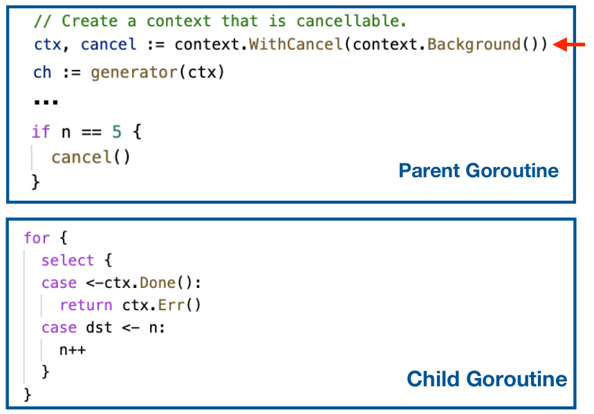

##### WithDeadline()

    ```go
        deadline := time.Now().Add(5 * time.Millisecond)
        ctx, cancel := context.WithDeadline(context.Background(), deadline)
        defer cancel()
    ```
* `WithDeadline()` takes parent context and clock time as input
* WithDeadline returns new Context that closes its done channel when the machine's clock advances past the given deadline

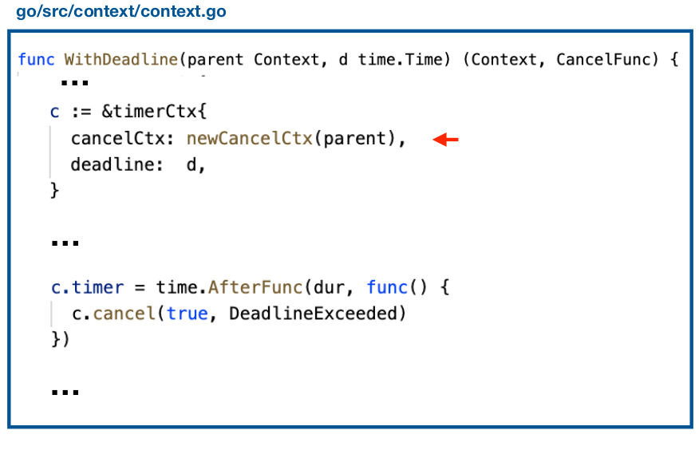
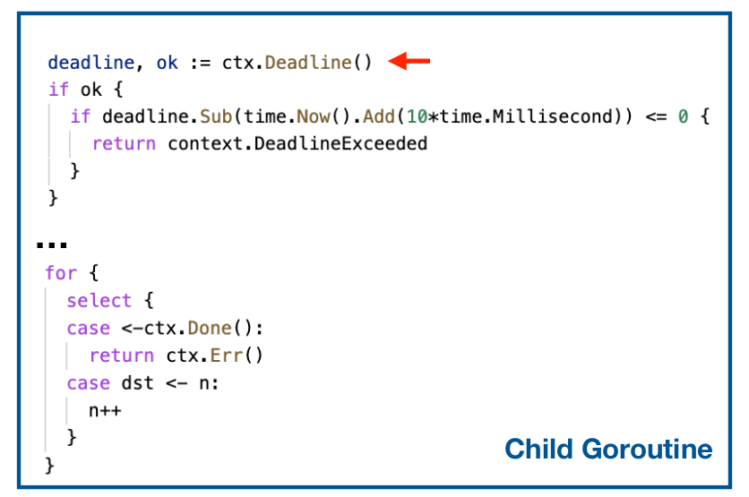

##### WithTimeout()

    ```go
        duration := 5 * time.Millisecond
        ctx, cancel := context.WithTimeout(context.Background(), duration)
        defer cancel()
    ```
  * `WithTimeout()` takes parent context and time duration as input
  * `WithTimeout()` returns a new Context that closes it's done channel after the given timeout duration
  * WithTimeout() is useful for setting a deadline on the requests to backend servers.
  * `WithTimeout() is a wrapper over WithDeadline()`

    ```go
        func WithTimeout(parent Context, timeout time.Duration) (Context, CancelFunc) {
            return WithDeadline(parent, time.Now().Add(timeout))
        }
    ```

###### Difference in using WithTimeout and WithDeadline
* `WithTimeout()` : timer countdown begins from the moment the context is created
* `WithDeadline()` : Set explicit time when timer will expire

### Context Package as Data bag
* Context Package can used to transport request-scoped data down the call graph
* `context.WithValue()` provides a way to associate request-scoped values with a Context.
* `context.Value()` - is used to extract the value given a key from the context.

    ```go
        type userIDType string

        // PARENT GO-ROUTINE
        ctx := context.WithValue(context.Background(), userIDType("userIDKey"), "jane") 

        // CHILD GO-ROUTINE
        userid := ctx.Value(userIDType("userIDKey")).(string)
    ```

### Go's Idioms for Context Package

##### Incoming requests to a server should create a Context
* Create context early in processing task or request
* Create a top level context
    ```go
        func main{
            ctx := context.Background()
        }
    ```
* `http.Request` value already contains a Context
    ```go
        func handlFunc(w http.ResponseWriter, requ *http.Request) {
            ctx, cancel := context.WithCancel(req.Context())
        }
    ```
##### Outgoing calls to servers should accept a Context
* Higher level calls needs to tell lower level calls how long they are willing to wait

    ```go
        // Create a context with a timeout of 100 milliseconds.
        ctx, cancel := context.WithTimeout(req.Context(), 100 * time.Millisecond)
        defer cancel()

        //Bind the new context into the request
        req = req.WithContext(ctx)

        // Do will handle the context level timeout
        resp, err := http.DefaultClient.Do(req)
    ```
* `http.DefaultClient.Do()` method to respect cancellation signal on timer expiry and return with error message

##### Pass a Context to function performing I/O
* Any function that is performing I/O should accept a `Context value as it's first parameter` and respect any timeout or deadline configured by the caller
* Any API's that takes a Context, the idiom is to have the first parameter accept the Context value.

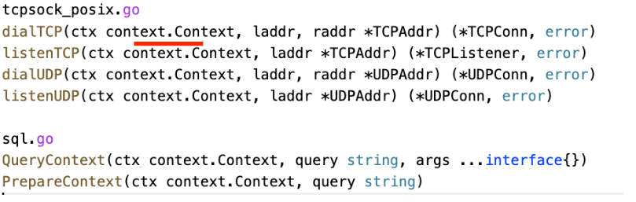

* Any change to a Context value creates a new Context value that is then propagated forward.

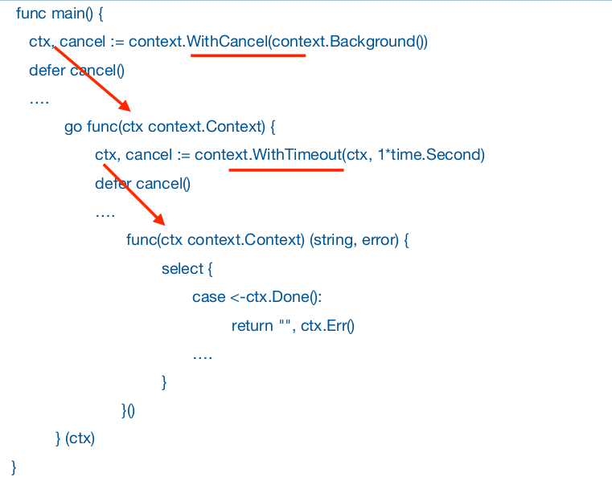

* When a Context is canceled, all Contexts derived from it are also canceled.
  * If a parent Context is cancelled, all children derived by that parent Context are cancelled as well.

###### Use TODO conext if you are unsure about which Context to use
* If a function is not responsible for creating top level context.
* We need a temporary top-level Context until we figured out where the actual Context will come from.

###### Use context values only for request-scoped data
* Do not use the Context value to pass data into a funciton which becomes essential for it's successful execution
* A function should be able to execute it's logic with an empty Context value.

#### HTTP Server Timeouts with Context Package.
* Setting timeouts in server is important to conserve system resources and to protect from DDOS attack.
* File descriptors are limited.
* Malicious user can open many client connections, consuming all file descriptors
* Server will not able to access any new connection
* `http: Accept error: accept tcp [::]:80: accept: too many open files; retrying in 1s`

###### net/http Timeouts
* There are four main timeouts exposed in http.server
    1. Read Timeout
    2. Read Header Timeout
    3. Write Timeout
    4. Idle Timeout

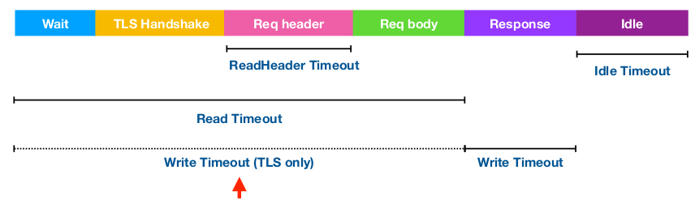

* `Read Timeout` : Covers the time from when the connection is accepted, to when the request body is fully read
* `ReadHeader Timeout`: Amount of time allowed to read request headers
* `Write Timeout`: covers the time from the end of the request body read to the end of the response write
* `Idle Timeout`: Maximum amount of time to wait for the next request when keep-alive is enabled.

###### Set Timeouts by explicitly using a server

    ```go
        srv := &http.Server {
            ReadTimeout: 1 * time.Second,
            ReadHeaderTimeout: 1 * time.Second,
            WriteTimeout: 1 * time.Second,
            IdleTimeout: 30 * time.Second,
            Handler: serveMux,
        }
    ```
* Set Connection timeouts when dealing with untrusted clients and networkds
* Protect server from clients which are slow to read and write.

##### HTTP Handler Functions
* Connection timeouts apply at network connection level
* HTTP Handler Functions are `unaware of these timeouts` they run to completion, consuming resources.

##### How to efficiently timeout http handler function ?
* net/http package provides TimeoutHandler()

    ```go
        srv := http.Server {
            Addr:           "localhost:8000",
            WriteTimeout:   2 * time.Second,
            Handler:        http.TimeoutHandler(http.HandlerFunc(slowHandler),
                                                1 * time.Second,
                                                "Timeout!\n"),
        }
    ```
* TimeoutHandler returns a Handler that runs input handler with the given time limit
* If input handler `runs for longer than it's time limit`, the handler sends the client a `503 service unavailable error` and HTML error message.

* We need to propagate the timeout awareness down the call graph

#### Context Timeouts and Cancellation

* Use Context timeouts and cancellation to propagate the cancellation signal down the call graph
* The Request type already has a context attached to it.

    ```go
        ctx := req.Context()
    ```
* Server cancels this context when
    * Client closes the connection
    * Timeout
    * ServeHTTP method returns

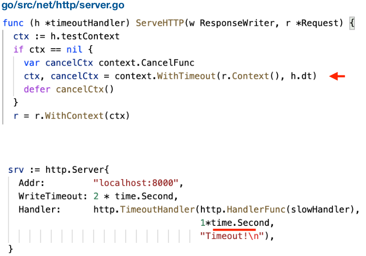
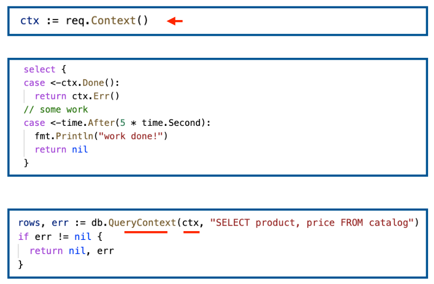