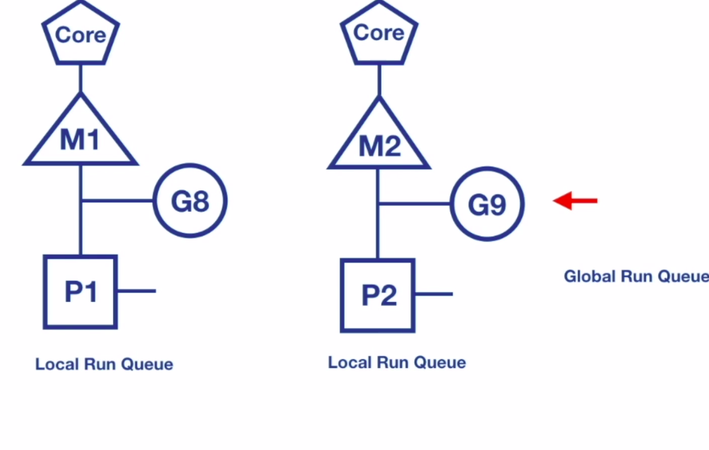

# Go-Routines

* Concurrency in go supports two style's of processes
### 1. Communicating Sequential Processes (CSP)
* Each process is built for `sequential execution`
* Data is communicated between processes. `No Shared Memory`
* `Scale` by adding more of the same

### 2. Shared memory multi-threading uses locks (and their ilk)

### Go's Concurrency Tool Set
- goroutines
- channels
- select
- sync package

## Goroutines

* We can think `Goroutines` as `user space threads managed by go runtime`
* Goroutines `extremely lightweight`. Goroutines starts with `2KB of stack`, which grows and shrinks as required.
* `Low CPU Overhead` - three instructions per function call
* Can `create hundreds of thousands of goroutines` in the same address space.
* `Channels` are used for `communication of data` between goroutines. Sharing of memory can be avoided.
* Context switching between goroutines is much `cheaper` than thread context switching, goroutines have very less state to be stored
* Go runtime can be more `selective` in `what is persisted` for retrieval, how it is persisted, and when the persisting needs to occur.

* `Go runtime creates worker OS threads`
* Goroutines runs in the context of OS thread.
* Many goroutines execute in the context of single OS thread


#### Client-Server Program

    ```go
    server.go
        func main() {
            ln, err := net.Listen("tcp", ":8080")
            if err != nil {
                log.Fatalf("Something went wrong while creating to Listener : %v", err)
            }
            for {
                conn, err := ln.Accept()
                if err != nil {
                    log.Printf("Something went wrong while accepting to conn : %v", err)
                    continue
                }
                handleConnection(conn)
            }
        }
    ```
    * In the above server program, server can handle only one client at a time, because here the main-go-routine itself handling the connection, it's not assigning to worker go-routine.


    ```go
        func main() {
            ln, err := net.Listen("tcp", ":8080")
            if err != nil {
                log.Fatalf("Something went wrong while creating to Listener : %v", err)
            }
            for {
                conn, err := ln.Accept()
                if err != nil {
                    log.Printf("Something went wrong while accepting to conn : %v", err)
                    continue
                }
                go handleConnection(conn)
            }
        }
    ```
    * In the above server program, server can handle multiple client connection's at a time, becasue here every time whenever client want's connect, the main-go-routine creating one new go routine and assigning the handle connection to child go-routine.


## Race Condition

* Race condition occurs `when order of exeuction is NOT guranteed`.
* Concurrent programs doesn't execute in the order they are coded.

    ```go
        package main

        import "log"

        func main() {
            var index int

            go func() {
                // Clousure
                index++
                log.Printf("Incremented index value : %d \n", index)
            }()

            if index == 0 {
                log.Printf("The value of index doesn't change i.e. : %d \n", index)
            }
        }
    ```
    * What could be possible outputs of this program ?

```shell
    After execution got below output.
    ==================================
    raja@raja-Latitude-3460:~/Documents/coding/golang/go-by-concurrency$ go run go-routines/wait_group.go
    2021/06/04 21:44:19 The value of index doesn't change i.e. : 0
    2021/06/04 21:44:19 Incremented index value : 1

    raja@raja-Latitude-3460:~/Documents/coding/golang/go-by-concurrency$ go run go-routines/wait_group.go
    2021/06/04 21:44:32 The value of index doesn't change i.e. : 0

    raja@raja-Latitude-3460:~/Documents/coding/golang/go-by-concurrency$ go run go-routines/wait_group.go
    2021/06/04 21:44:19 Incremented index value : 1
```

* There are multiple ways to avoid this (i.e. Race conditions/ un-expected output) i.e. to make `main routine` wait for goroutine to execute before checking value of data.

1. WaitGroup
2. Channels


### WaitGroup

* Deterministically block main goroutine

    ```go
        var wg sync.WaitGroup
        wg.Add(1) // Should add the count of go-routines going to create

        go func() {
            defer wg.Done() // should call wg.Done() at any-cost before returning from the func so that it will reduce the count of active go-routines
            .....
        }()

        wg.Wait() // wait till all go-routines completes i.e. count should be 0
    ```

* So it's basically like forking go routine and joining back once it completes.


### Closures

* Goroutines execute within the `same address space`  they are created in
* They can directly modify variables in the enclosing lexical block.

    ```go
        package main

        import (
            "log"
            "sync"
        )

        func main() {
            var wg sync.WaitGroup

            incr := func(wg *sync.WaitGroup) {
                var index int
                wg.Add(1)
                go func() {
                    defer wg.Done()
                    index++
                    log.Printf("[Child-Rouinte] Value of index : %d \n", index)
                }()
                log.Printf("[Main-Rouinte] Returning from the incr function : %d \n", index)
            }
            incr(&wg)
            wg.Wait()
            log.Println("[Main-Rouinte] Exiting....")
        }
    ```

* When we execute the program, we can observe the below response


#### Observations
  1. In the above code `index` varaible is defined in the incr funciton scope
  2. But still we can access this in f`function literal`
  3. even we can can modify the value of index in `function literal`
  4. Finally, even after returning the incr()(incr stack will be removed), still go-routine can access the varaible and modified on top of latest value of index.

###### Note : Here Go-Runtime will create copy of latest index variable in heap and make available of go-routines so that whenever go-routines get chance to execute the variable it will get the latest value from the HEAP.

    ```go
        package main

        import (
            "log"
            "sync"
        )

        func main() {
            var wg sync.WaitGroup

            for index := range []int{1, 2, 3} {
                wg.Add(1)

                go func() {
                    wg.Done()
                    log.Printf("[Go-Routine] The Value of index : %d \n", index)
                }()
            }

            wg.Wait()
            log.Printf("[main-routine] Exiting............")
        }
    ```
* If we execute the above code the value of index is almost always `2` (latest and last index value), why because by the time go-routine get chance to execute the function literal the main routine loop-through entirely and making the index value as last index value


* To Overcome the above issue pass index variable as argument to the funciton literal.

    ```go
        package main

        import (
            "log"
            "sync"
        )

        func main() {
            var wg sync.WaitGroup

            for index := range []int{1, 2, 3} {
                wg.Add(1)

                go func(counter int) {
                    wg.Done()
                    log.Printf("[Go-Routine] The Value of index : %d \n", counter)
                }(index)
            }

            wg.Wait()
            log.Printf("[main-routine] Exiting............")
        }
    ```


### Go Scheduler (M:N Scheduler)

* The Go Scheduler is part of the Go Runtime. It is known as `M:N scheduler`
* Go Scheduler runs in user space.
* Go Scheduler uses OS threads to schedule goroutines for executions.
* Go runtime create number of worker OS threads, <= `GOMAXPROCS` (max cpu cores)
* `GOMAXPROCS` - default value is number of processors on machine
* Go Scheduler distributes runnable goroutines over multiple worker OS threads.
* At any time, N goroutines could be scheduled on M OS threads that runs on at most GOMAXPROCS numbers of processors.

#### Asynchronous Preempation

* As of Go 1.14, Go scheduler implements asynchronous preemption.
* This prevents long running goroutines form hogging onto CPU, that could block other goroutines.
* The asynchronous premption is triggered based on a time condition. When a goroutine is running for more than 10ms, Go will try to preempt it.

##### Go Routine States


##### Components of Go Scheduler


* M - represents OS worker Thread
* P - is the logical processor, which manages scheduling of goroutines.
* G - is the goroutine, which also includes scheduling information like stack and instruction pointer.
* Local Run Queue - where runnable goroutines are arranged
* Global run queue - when a goroutine is created, they are placed into global run queue.

##### Context Switch due to Synchronous System Call

* What happens in general when synchronous system call are made ?
  * Synchronous system calls wait for I/O operation to be completed
  * OS thread is moved out of the CPU to waiting queue for I/O to complete.
  * Synchronous system call reduces parallelism.
* How does context switching works when a goroutine calls synchronous system call ?
  * When Goroutine makes synchronous system call, Go scheduler bring a new OS thread from thread pool
  * moves the logical processor `P` to new thread (`M2`).
  * Goroutine which made the system call will still be attached to the old thread (`M1`)
  * Other Goroutines in Local Run Queue (LRQ) are scheduled for execution on new OS thread (`M2`)
  * Once system call returns, Goroutine is moved back to run queue on logical processor `P` and old thread is put to sleep.


##### Context Switching due to Asynchronous System calls
* What happens in general when asynchronous system call are made ?
  * File descriptor is set to non-blocking mode
  * If file descriptor is not ready for I/O operation, system call doesn't block, but return an error.
  * Asynchronous IO increases the application complexity by seting up event loops using callbacks functions
  * `So to overcome complexity Go uses netpoller to handle asynchronous system call`

###### netpoller
* Netpoller to convert asynchronous system call to blocking system call.
* When a goroutine makes a asynchronous system call, and file descriptor is not ready, goroutine is parked at netpoller os thread
* netpoller uses interface provided by OS to do polling on file descriptors using os based pools like
  * kqueue (MacOS)
  * epoll (Linux)
  * iocp (Windows)
* Netpoller gets notification from OS, when file descriptor is ready for I/O operation
* Netpoller notifies goroutine to retry I/O operation
* Complexity of managing asynchronous system call is moved form applicaiton to Go runtime, which manages it efficiently.


### Work Stealing
* Work stealing helps to balance the goroutines across all logical processors
* Work gets better distributed and gets done more efficiently.

##### Work Stealing Rule
* If there is no goroutines in local run queue
  * Try to steal from other logical processors
  * If not found, check the global runnable queue for a G (goroutines)
  * If not found, check netpoller.


