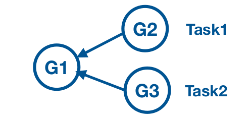

# select

* Select is switch like statement with each case specifing channel operation
* Irrespective of order, select case statements will execute whatever channel is ready to process.
* Select will block until any of the case statement is ready
* With select we can implement `timeout` and `non-blocking` communication.
* select on `nil` channel will block forever.

### Scenario

* As shown in the below, G1 wants to receive result of computation from G2 and G3




* In What order are we going to receive results ?
    * Option 1) first G2 and then G3 ?
    * Option 2) first G3 and then G2 ?
    * Option 3) Both at same time ?
    * Option 4) What if G3 was much faster than G2 in one instance, and G2 is faster than G3 in another ?

* So, we can't predict which routine will comes fast and then second.. so to overcome this we need to do operation on channel which ever irrespective of the order.
* To implement that we do have `select` statement

#### select

* select statement is like a switch statement
* Each case specifies communication
* All channel operation are considered simultaneously.

###### syntax

    ```go
        select {
        case <- ch1:
            // block of statements
        case <- ch2:
            // block of statements
        case ch3 <- struct{}{}
            // block of statements
        }
    ```
* select waits until some case is ready to proceed
* when one of the channels is ready, that operation will proceed.
* select is also very helpful in implementing
  * Timeous
  * Non-blocking communication

##### Timeout waiting on channel

    ```go
        select {
        case v := <- ch:
            fmt.Println("Got Value : ", v)
        case <- time.After(3 * time.Second):
            fmt.Println("Timeout occured")
        }
    ```
* select waits until there is event on channel(ch) or until timeout is reached
* The time.After() function takes in a time.Duration argument and returns a channel that will send the current time after the duration you provide it.

###### Non-blocking communication

    ```go
        select {
        case m := <- ch:
            fmt.Println("Received message", m)
        default:
            fmt.Println("Haven't received any message, so processing default")
        }
    ```
* send or receive on a channel, but avoid blocking if the channel is not ready
* Default allows you to exit a select block without blocking.

#### Notes
* Empty select statement will `block forever`

    ```go
        select{}
    ```
* select on `nil` channel will block forever.

    ```go
        var ch chan string
        select {
            case v := <-ch:
            case ch <- v:
        }
    ```