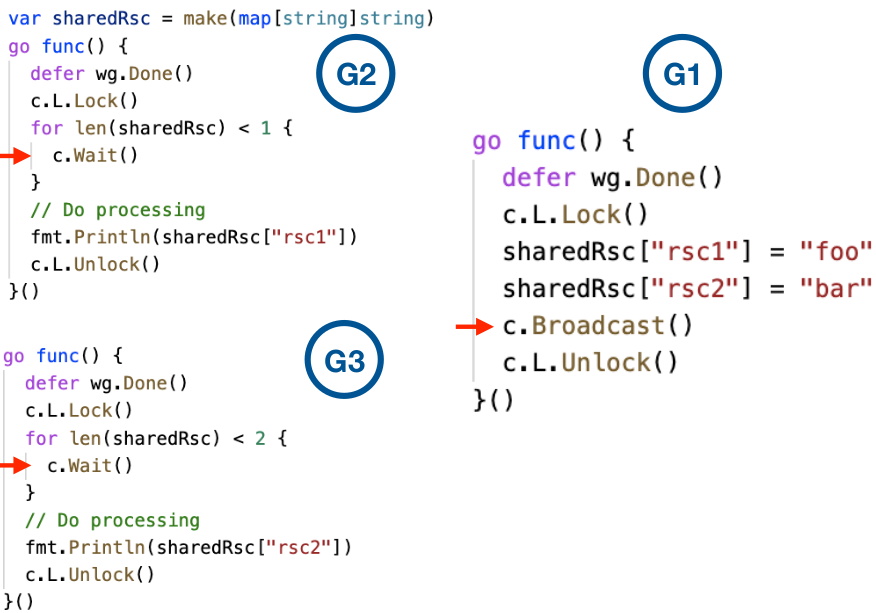

## Sync package

##### `sync.Mutex`
* We've seen how channels are great for communication among goroutines.
* But what if we don't need communication? What if we just want to make sure only one goroutine can access a variable at a time to avoid conflicts?
* This concept is called `mutual exclusion`, and the conventional name for the data structure that provides it is `mutex`.
* Go's standard library provides mutual exclusion with `sync.Mutex` and its two methods:
    * Lock
    * Unlock
* We can define a block of code to be executed in mutual exclusion by surrounding it with a call to Lock and Unlock.

#### When to use channels and when to use mutex
###### Channels
* Channels can be used by passing copy of data
* Distributing units of work
* Communicating asychhronous results

###### Mutex
* When ever we want to update cache
* When ever we want to update state/registries
* Used for protect shared resources
* `sync.Mutext` - Prodvide exclusive access to a shared resources

    ```go
        var mu sync.Mutext
        var balance float64 

        go func() {
            mu.Lock()
            balance += amount
            mu.Unlock
        }

        go func() {
            mu.Lock()
            defer mu.Unlock()

            balance -= amount
        }
    ```
* `sync.RWMutex` - Allows multiple readers. Writers get exclusive lock

    ```go
        var mu sync.Mutext
        var balance float64 

        // Writer Lock
        go func() {
            mu.Lock()
            balance += amount
            mu.Unlock
        }

        go func() {
            mu.RLock()
            defer mu.RUnlock()

            ch <- balance
        }
    ```
* Mutex is used as guards access to shared resources
* It is developers convention to call `Lock()` to access shared memory and call `Unlock()` when done
* The critical section represents the bottleneck between the goroutines.

### `sync.Atomic`

* `sync.Atomic` can be used for low level atomic operations on memory
* Lockless operation
* Used for atomic operations on counters.

    ```go
        var counter uint64

        atomic.AddUint64(&counter, 1) // Incrementing counter value

        value := atomic.LoadUint63(&counter) // Getting counter value
    ```

### `sync.Cond`

* Condition Variable is one of the synchronization mechanisms.
* A Condition variable is basically a container of goroutines that are waiting for a certain condition

###### How to make a goroutine wait till some event (condition) occur ?

1. One Way - Wait in a loop for the condition

    ```go
        var cache = make(map[string]string)
        var wg sync.WaitGroup
        var m sync.Mutex

        wg.Add(1)
        go func() {
            defer wg.Done()
            m.Lock()

            for len(cache) == 0 {
                m.Unlock()
                time.Sleep(1 * time.Second)
                m.Lock()
            }
            log.Printf("Got Cache value : %s\n", cache["key"])
            m.Unlock()
        }
    ```
    * We need some way to make goroutine suspend while waiting.
    * We need some way to signal the suspended goroutine when particular event has occured.

    * Can we use Channels ?
      * We can use channels to block a goroutine on receive
      * Sender goroutine to indicate occurence of event
      * What if there are multiple goroutines waiting on multiple conditions/events?
  * Here We can use `sync.Cond` to address the above problems.

* Conditional variable are type

* we use constructor method `sync.NewCond()` to create a conditional variable, it takes `sync.Locker` interface as input, whihc is usually `sync.Mutex`

        ```go
        var c *sync.Cond
        m := sync.Mutex{}
        c = sync.NewCond(&m)

        (Or)

        c := sync.NewCond(&sync.Mutext{})
        ```

* sync.Cond has 3 methods
    1. c.Wait()
    2. c.Signal()
    3. c.Broadcast()
##### `c.Wait()`
* suspends execution of the calling goroutine
* automaically unlocks c.L
* Wait cannot return unless awoken by Broadcast or Signal.
* Wait locks c.L before returning
* Because c.L is not locked when Wait first resumes, the caller typically cannot assume that the condition is true when Wait returns. Instead, the caller should wiat in a loop.

    ```go
        c := sync.NewCond(&sync.Mutext{})

        c.L.Lock()

        for !condition() {
            c.Wait()
        }
        .... make use of condition.....
        c.L.Unlock()
    ```

##### `c.Singal()`

* Signal wakes one goroutine waiting on c, if there is any.
* Signal finds goroutine that has been waiting the longes and notifies that
* It is allowed but not required for the caller to hold c.L during the call.

    ```go
        func (c *Cond) Signal()
    ```

##### `c.Broadcast()`

* Broadcast wakes all goroutines waiting on c.
* It is allowed but not requried for the caller to hold c.L during the call.

    ```go
        func (c *Cond) Broadcast()
    ```




### sync.Once
* Run one-time intialization functions
* `sync.Once` ensure that only one call to `Do` ever calls the function passed in - even on different goroutines.

    ```go
        sync.Once.Do(func())
    ```

### sync.Pool
* create and make available pool of things for use e.g. db conn's, any costly objects

    ```go
        // Getting from pool
        b := bufPool.Get().(*bytes.Buffer)

        // Adding back to pool
        bufPool.Put(b)
    ```